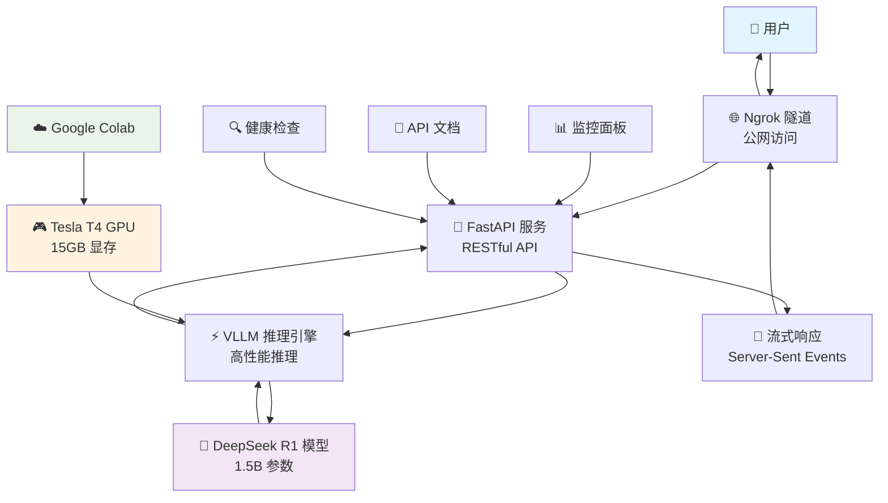

# DeepSeek R1 VLLM 部署实验 🚀

> **一个零门槛的大语言模型部署教程**  
> 使用 Google Colab 免费 GPU + VLLM + FastAPI 快速部署 DeepSeek R1 模型

[](https://colab.research.google.com/github/FlyAIBox/LLM-101/blob/main/chapter03-llm-deploy/vllm/deepseek_r1_distill_qwen_fast_api.ipynb)

## 🎯 项目目标

**让任何人都能在 10 分钟内免费部署一个可用的大语言模型 API 服务**

### 💡 核心价值
- **零成本学习**: 使用 Google Colab 免费 T4 GPU (15GB 显存)
- **零环境配置**: 浏览器打开即用，无需安装任何软件
- **生产级实践**: 学习 VLLM + FastAPI 的企业级部署方案
- **完整流程**: 从模型加载到 API 服务的完整实现

## 📋 你将学到什么

| 技术栈 | 学习内容 | 实际收获 |
|--------|----------|----------|
| **VLLM** | 高性能模型推理引擎 | 掌握大模型部署优化技术 |
| **FastAPI** | 现代 Python Web 框架 | 学会构建高性能 API 服务 |
| **DeepSeek R1** | 最新推理增强模型 | 体验前沿模型能力 |
| **Docker 化部署** | 容器化服务部署 | 了解生产环境部署方案 |

## 🎓 Colab适合人群

### ✅ 最适合
- **AI 技术初学者**: 想要实际动手体验大模型部署
- **后端开发者**: 希望了解 AI 模型服务化
- **学生群体**: 需要零成本学习 AI 技术
- **技术爱好者**: 想要快速上手最新技术

### ⚠️ 不太适合
- 已有丰富大模型部署经验的专家
- 需要企业级高可用部署的生产项目
- 对延迟要求极高的实时应用

## 📊 项目特色

### 🎯 技术亮点
- **内存优化**: 使用 FP16 精度，15GB 显存轻松运行 1.5B 模型
- **高并发支持**: VLLM 引擎支持批量推理和连续批处理
- **流式响应**: 支持 Server-Sent Events (SSE) 实时流式输出
- **OpenAI 兼容**: API 接口完全兼容 OpenAI ChatGPT 格式

### 🛡️ 生产级特性
- **健康监控**: 内置服务健康检查和状态监控
- **错误处理**: 完善的异常捕获和错误响应机制
- **日志记录**: 详细的请求日志和性能指标
- **安全防护**: 请求验证和速率限制

## 🔧 核心技术架构




## 🚀 快速开始

在运行之前，请确保您具备：

### 🎯 必需条件

- **Google 账户**：用于访问 Google Colab（完全免费）
- **网络连接**：稳定的互联网连接用于模型下载和推理

### 🚀 推荐配置

- **GPU 运行时**：在 Colab 中启用 GPU 加速（Tesla T4 免费提供）
- **Google Drive**：用于保存代码和模型文件（可选）

### 💡 免费资源说明

- **完全免费**：Google Colab 提供的 Tesla T4 GPU（15GB 显存）
- **无需付费**：所有基础功能都可以免费使用
- **即开即用**：无需安装任何软件或配置环境

### 第一步：打开 Colab 环境
1. 点击这个按钮 👇

   [](https://colab.research.google.com/github/FlyAIBox/LLM-101/blob/main/chapter03-llm-deploy/vllm/deepseek_r1_distill_qwen_fast_api.ipynb)

2. 登录您的 Google 账户（如果还没有账户，免费注册一个）
3. 选择 GPU 运行时：`代码执行程序` → `更改运行时类型` → `T4 GPU`

### 第二步：一键运行部署
```python
# 只需运行笔记本中的代码单元格，全自动完成：
# ✅ 环境检查和依赖安装
# ✅ DeepSeek R1 模型下载和加载  
# ✅ VLLM 推理服务启动
# ✅ FastAPI Web 服务创建
# ✅ Ngrok 公网隧道建立
```
**只需要做一件事：按顺序运行每个代码单元格**
1. 点击第一个代码单元格
2. 按 `Shift + Enter` 运行
3. 等待运行完成后，继续运行下一个单元格
4. 重复直到所有单元格运行完成


### 第三步：获得可用的 API 服务
运行完成后，您将获得：
- 🌐 **公网 API 地址**: `https://xxx.ngrok.io`
- 📖 **交互式文档**: `https://xxx.ngrok.io/docs`
- 💬 **聊天接口**: `https://xxx.ngrok.io/v1/chat/completions`

## 📱 测试你的 API

### 方法1：使用浏览器
访问 `https://你的地址.ngrok.io/docs`，在页面上直接测试

### 方法2：使用 curl 命令
```bash
curl -X POST "https://你的地址.ngrok.io/v1/chat/completions" \
  -H "Content-Type: application/json" \
  -d '{
    "model": "deepseek-ai/DeepSeek-R1-Distill-Qwen-1.5B",
    "messages": [{"role": "user", "content": "你好"}],
    "max_tokens": 100
  }'
```

### 方法3：使用 Python
```python
import requests

response = requests.post("https://你的地址.ngrok.io/v1/chat/completions", json={
    "model": "deepseek-ai/DeepSeek-R1-Distill-Qwen-1.5B", 
    "messages": [{"role": "user", "content": "介绍一下你自己"}],
    "max_tokens": 200
})

print(response.json())
```


## ⚙️ 配置参数说明

### 模型配置
```python
VLLM_CONFIG = {
    "model": "deepseek-ai/DeepSeek-R1-Distill-Qwen-1.5B",
    "dtype": "half",              # FP16 精度，节省显存
    "max_model_len": 16384,       # 最大序列长度
    "gpu_memory_utilization": 0.8, # GPU 显存使用率
    "tensor_parallel_size": 1,    # 单卡部署
    "trust_remote_code": True     # 信任远程代码
}
```

### 服务配置
```python
API_CONFIG = {
    "host": "0.0.0.0",
    "port": 8000,
    "workers": 1,
    "timeout": 300,
    "max_concurrent_requests": 10
}
```

## 🚧 常见问题解决

### 1. 模型下载失败
```bash
# 问题：网络连接超时
# 解决：使用镜像源
!pip install -U huggingface_hub
!huggingface-cli download deepseek-ai/DeepSeek-R1-Distill-Qwen-1.5B --local-dir ./model
```

### 2. GPU 内存不足
```python
# 问题：CUDA out of memory
# 解决：调整配置参数
gpu_memory_utilization = 0.7  # 降低显存使用率
max_model_len = 8192          # 减少最大序列长度
```

### 3. Ngrok 连接失败
```python
# 问题：隧道创建失败
# 解决：检查 authtoken 设置
from pyngrok import ngrok
ngrok.set_auth_token("your_token_here")  # 替换为实际 token
```

## 🙏 致谢

- [VLLM 团队](https://github.com/vllm-project/vllm) - 高性能推理引擎
- [DeepSeek AI](https://github.com/deepseek-ai) - 优秀的开源模型
- [Google Colab](https://colab.research.google.com/) - 免费 GPU 资源
- [FastAPI](https://fastapi.tiangolo.com/) - 现代 Web 框架
