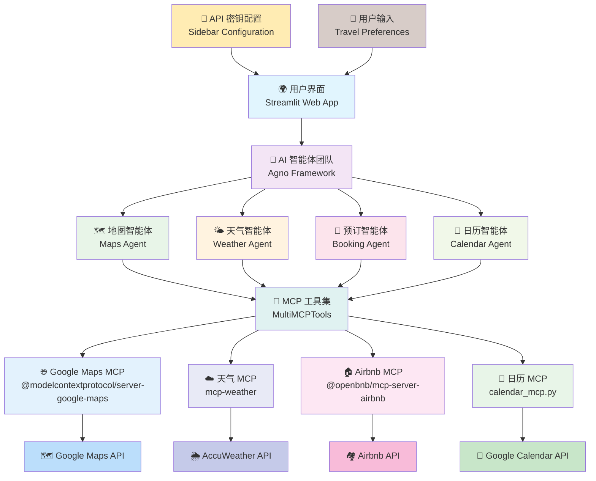

# 🌍 AI 旅行规划 MCP 智能体

这是一个基于 Streamlit 的应用程序，帮助用户使用 AI 规划旅行行程。该应用程序集成了多个 MCP 服务器，提供全面的旅行规划体验，包括天气预报、地图导航和日历集成。

## 功能特性



### MCP 服务器集成

本项目利用多个 MCP（模型上下文协议）服务器提供全面的旅行规划体验：

### 1. 天气 MCP 服务器
- **功能**：提供实时天气数据和预报
- **特性**：
  - 获取目的地详细天气预报
  - 严重天气条件预警
  - 基于天气条件的活动建议
  - 最佳旅行时间推荐

### 2. 地图 MCP 服务器
- **功能**：处理基于位置的服务和导航
- **特性**：
  - 搜索地点和兴趣点
  - 获取详细地点信息
  - 获取驾车/步行路线
  - 计算旅行时间和距离
  - 交通状况和路线优化

### 3. 日历 MCP 服务器
- **功能**：管理日历事件和日程安排
- **特性**：
  - 创建和管理日历事件
  - 处理时区转换
  - 安排提醒和通知
  - 协调团队成员日程
- **集成**：在 `calendar_mcp.py` 中实现

### 4. 预订 MCP 服务器
- **功能**：Airbnb MCP 服务器用于住宿预订
- **特性**：
  - 在预算范围内查找住宿
  - 跨平台价格比较
  - 检查特定日期的可用性
  - 验证设施和政策

## 系统架构

### 核心组件

1. **多智能体系统**：
   - 地图智能体：负责路线规划和位置服务
   - 天气智能体：提供天气预报和建议
   - 预订智能体：处理住宿预订
   - 日历智能体：管理行程安排

2. **MCP 协议集成**：
   - 统一的工具接口
   - 异步处理能力
   - 环境变量管理

3. **用户界面**：
   - Streamlit 响应式界面
   - 实时配置管理
   - 交互式表单设计

## 安装配置

### 环境要求

1. **API 密钥和凭证**：
   - **Google Maps API 密钥**：从 Google Cloud Console 设置 Google Maps API 密钥
   - **Google Calendar API**：启用并配置 Calendar API 密钥
   - **Google OAuth 凭证**：用于身份验证的客户端 ID、客户端密钥和刷新令牌
   - **AccuWeather API 密钥**：从 https://developer.accuweather.com/ 获取 AccuWeather API 密钥
   - **OpenAI API 密钥**：在 OpenAI 注册以获取您的 API 密钥

2. **Python 3.8+**：确保您安装了 Python 3.8 或更高版本

### 安装步骤

1. 克隆此存储库：
   ```bash
   git clone https://github.com/yourusername/ai_travel_planner_mcp_agent_team
   cd ai_travel_planner_mcp_agent_team
   ```

2. 安装所需的 Python 包：
   ```bash
   pip install -r requirements.txt
   ```

3. 设置环境变量：
   在项目根目录创建 `.env` 文件，包含以下变量：
   ```
   GOOGLE_CLIENT_ID=你的Google客户端ID
   GOOGLE_CLIENT_SECRET=你的Google客户端密钥
   GOOGLE_REFRESH_TOKEN=你的Google刷新令牌
   GOOGLE_MAPS_API_KEY=你的Google地图API密钥
   OPENAI_API_KEY=你的OpenAI API密钥
   ACCUWEATHER_API_KEY=你的AccuWeather API密钥
   ```

### 运行应用程序

1. 为 Google Calendar 生成 OAuth 令牌

2. 启动 Streamlit 应用程序：
   ```bash
   streamlit run app.py
   ```

3. 在应用程序界面中：
   - 使用侧边栏配置您的首选项
   - 输入您的旅行详细信息
   - 点击"规划我的旅行"按钮

## 项目结构

```
ai_travel_planner_mcp_agent_team/
├── app.py                 # 主 Streamlit 应用程序
├── calendar_mcp.py        # 日历 MCP 集成功能
├── requirements.txt       # 项目依赖
├── README.md             # 英文文档
├── README-zh.md          # 中文文档
└── .env                  # 环境变量（需要创建）
```

## 日历 MCP 集成详解

`calendar_mcp.py` 模块通过 MCP（模型上下文协议）框架提供与 Google Calendar 的无缝集成。此集成允许旅行规划器：

### 功能特性

- **创建事件**：自动为旅行活动、航班和住宿创建日历事件
- **日程管理**：处理时区转换和日程冲突
- **事件详情**：包含全面的事件信息，如：
  - 带有 Google Maps 链接的位置详情
  - 事件时间的天气预报
  - 旅行持续时间和交通详情
  - 备注和提醒

### 日历设置

1. **OAuth 身份验证**：
   - 应用程序使用 OAuth 2.0 进行与 Google Calendar 的安全身份验证
   - 首次设置需要生成刷新令牌
   - 刷新令牌安全存储在 `.env` 文件中

2. **事件创建示例**：
   ```python
   # 创建日历事件的示例
   event = {
       'summary': '飞往巴黎的航班',
       'location': '戴高乐机场',
       'description': '航班详情和天气预报',
       'start': {'dateTime': '2024-04-20T10:00:00', 'timeZone': 'Europe/Paris'},
       'end': {'dateTime': '2024-04-20T12:00:00', 'timeZone': 'Europe/Paris'}
   }
   ```

## 使用指南

### 基本使用流程

1. **配置 API 密钥**：在侧边栏输入所有必需的 API 密钥
2. **输入旅行信息**：
   - 出发地和目的地
   - 旅行日期
   - 预算
   - 旅行偏好
3. **选择偏好设置**：
   - 住宿类型
   - 交通方式
   - 饮食限制
4. **生成旅行计划**：点击"规划我的旅行"按钮

### 高级功能

- **多智能体协作**：不同智能体协同工作提供最佳建议
- **实时天气集成**：基于天气条件调整行程
- **预算优化**：在预算范围内找到最佳选择
- **日历同步**：自动将重要事件添加到日历

## 技术栈

- **前端**：Streamlit
- **后端**：Python, AsyncIO
- **AI 框架**：Agno (Agent Framework)
- **API 集成**：Google Maps, Google Calendar, AccuWeather, OpenAI
- **协议**：MCP (Model Context Protocol)

## 故障排除

### 常见问题

1. **API 密钥错误**：
   - 确保所有 API 密钥都正确输入
   - 检查 API 密钥是否有效且未过期

2. **OAuth 认证问题**：
   - 确保 Google OAuth 凭证正确配置
   - 检查刷新令牌是否有效

3. **网络连接问题**：
   - 确保网络连接稳定
   - 检查防火墙设置

## 贡献指南

欢迎贡献代码！请遵循以下步骤：

1. Fork 项目
2. 创建功能分支 (`git checkout -b feature/AmazingFeature`)
3. 提交更改 (`git commit -m 'Add some AmazingFeature'`)
4. 推送到分支 (`git push origin feature/AmazingFeature`)
5. 打开 Pull Request

## 许可证

本项目采用 MIT 许可证 - 详情请参阅 [LICENSE](LICENSE) 文件。

## 支持

如果您遇到任何问题或有疑问，请：

1. 查看文档和 FAQ
2. 搜索现有的 Issues
3. 创建新的 Issue 描述您的问题

---

**注意**：此应用程序需要有效的 API 密钥才能正常工作。请确保您已获得所有必需的 API 访问权限。 

## 参考
1. [模型上下文协议（MCP）简介](https://huggingface.co/learn/mcp-course/unit1/introduction)