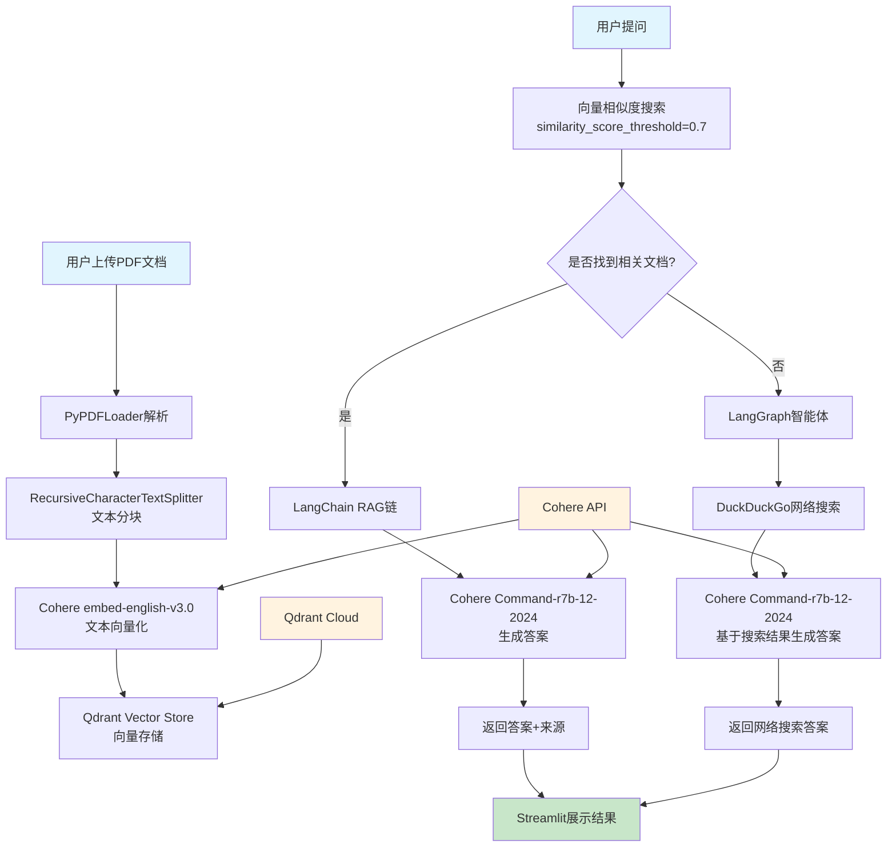

# RAG Agent with Cohere (中文文档)

基于 Cohere 最新模型 Command-r7b-12-2024 构建的 RAG 智能体系统，集成 Qdrant 向量存储、Langchain RAG 功能和 LangGraph 编排。该应用程序允许用户上传文档、询问相关问题，并在需要时自动回退到网络搜索获得 AI 驱动的响应。

## 功能特性

- **文档处理**
  - PDF 文档上传和处理
  - 自动文本分块和嵌入
  - Qdrant 云端向量存储

- **智能查询**
  - 基于 RAG 的文档检索
  - 相似度搜索与阈值过滤
  - 无相关文档时自动回退到网络搜索
  - 答案来源归属

- **高级功能**
  - DuckDuckGo 网络搜索集成
  - LangGraph 网络研究智能体
  - 上下文感知响应生成
  - 长答案摘要

- **模型特定功能**
  - Command-r7b-12-2024 模型用于聊天和 RAG
  - cohere embed-english-v3.0 模型用于嵌入
  - 来自 langgraph 的 create_react_agent 函数
  - 用于网络搜索的 DuckDuckGoSearchRun 工具

## 先决条件



### 1. Cohere API 密钥
1. 访问 [Cohere 平台](https://dashboard.cohere.ai/api-keys)
2. 注册或登录您的账户
3. 导航到 API 密钥部分
4. 创建新的 API 密钥

### 2. Qdrant 云端设置
1. 访问 [Qdrant Cloud](https://cloud.qdrant.io/)
2. 创建账户或登录
3. 创建新集群
4. 获取您的凭据：
   - Qdrant API 密钥：在 API 密钥部分找到
   - Qdrant URL：您的集群 URL（格式：`https://xxx-xxx.aws.cloud.qdrant.io`）

## 运行方法

1. 克隆仓库：
```bash
git clone https://github.com/Shubhamsaboo/awesome-llm-apps.git
cd rag_tutorials/rag_agent_cohere
```

2. 安装依赖：
```bash
pip install -r requirements.txt
```

3. 运行应用程序：
```bash
streamlit run rag_agent_cohere.py
```

## 使用指南

1. **配置 API 凭据**
   - 在侧边栏输入您的 Cohere API 密钥
   - 输入您的 Qdrant API 密钥和 URL
   - 点击"提交凭据"验证连接

2. **上传文档**
   - 点击文件上传器选择 PDF 文件
   - 等待文档处理和向量化完成

3. **提问**
   - 在聊天输入框中输入您的问题
   - 系统将搜索相关文档并提供答案
   - 如果找不到相关文档，系统会自动进行网络搜索

4. **查看来源**
   - 点击"来源"展开器查看答案的来源文档
   - 系统会显示相关文档片段

## 技术架构

### 核心组件
- **前端界面**：Streamlit Web 应用
- **语言模型**：Cohere Command-r7b-12-2024
- **嵌入模型**：Cohere embed-english-v3.0
- **向量数据库**：Qdrant Cloud
- **文档处理**：LangChain PDF 加载器和文本分割器
- **智能体编排**：LangGraph

### 系统架构流程图

```
                    用户上传PDF文档
                           ↓
                    PyPDFLoader解析
                           ↓
              RecursiveCharacterTextSplitter文本分块
                           ↓
              Cohere embed-english-v3.0文本向量化
                           ↓
                   Qdrant Vector Store向量存储

用户提问 → 向量相似度搜索 → 是否找到相关文档？
                                    ↓
                              是 ←──────→ 否
                              ↓            ↓
                         LangChain RAG   LangGraph智能体
                              ↓            ↓
                    Cohere生成答案    DuckDuckGo网络搜索
                              ↓            ↓
                         返回答案+来源  返回网络搜索答案
                              ↓            ↓
                              Streamlit展示结果
```

### 工作流程详解


1. **文档处理阶段**：
   - 用户上传 PDF → PyPDFLoader 解析 → 文本分块（chunk_size=1000, overlap=200）
   - 使用 Cohere embed-english-v3.0 生成向量 → 存储到 Qdrant Cloud

2. **查询处理阶段**：
   - 用户提问 → 向量相似度搜索（阈值=0.7，最多检索10个文档）
   - 找到相关文档：使用 LangChain RAG 链生成答案
   - 未找到相关文档：LangGraph 智能体执行网络搜索并生成答案

3. **答案生成阶段**：
   - 使用 Cohere Command-r7b-12-2024 模型生成最终答案
   - 提供来源归属和上下文信息

## 主要依赖

- `langchain==0.3.12` - LangChain 核心框架
- `langchain-cohere==0.3.2` - Cohere 集成
- `langchain-qdrant==0.2.0` - Qdrant 向量存储
- `streamlit==1.40.2` - Web 应用框架
- `langgraph==0.2.53` - 智能体编排
- `duckduckgo-search==6.4.1` - 网络搜索工具

## 注意事项

- 确保您的 Qdrant 集群正在运行且可访问
- Cohere API 有速率限制，请合理使用
- PDF 文件大小建议不超过 10MB 以获得最佳性能
- 网络搜索作为回退机制，可能会有延迟

## 故障排除

1. **连接错误**：检查 API 密钥和 URL 是否正确
2. **处理缓慢**：大文件需要更长时间处理，请耐心等待
3. **搜索失败**：网络搜索可能受到速率限制，稍后重试

## 许可证

本项目遵循开源许可证，详情请查看 LICENSE 文件。 