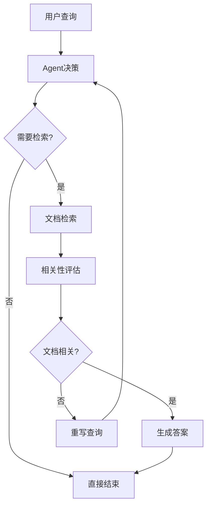

# LangChain Agent深度学习指南

## 目录
1. [Agent基础概念](#agent基础概念)
2. [LangGraph工作原理](#langgraph工作原理)
3. [RAG系统架构](#rag系统架构)
4. [核心组件详解](#核心组件详解)
5. [实战案例分析](#实战案例分析)
6. [进阶开发技巧](#进阶开发技巧)
7. [常见问题解答](#常见问题解答)

---

## Agent基础概念

### 什么是Agent（智能体）？

Agent是一个能够**自主感知环境、做出决策并执行行动**的AI系统。在LangChain中，Agent具备以下核心能力：

#### 🧠 认知能力
- **理解输入**：分析用户查询的意图和上下文
- **推理决策**：基于当前状态选择最佳行动方案
- **学习适应**：从交互中学习，优化后续决策

#### 🛠️ 执行能力
- **工具调用**：能够调用外部工具和API
- **状态管理**：维护对话历史和上下文信息
- **错误处理**：处理异常情况并进行恢复

#### 🔄 交互能力
- **多轮对话**：支持复杂的多轮交互
- **上下文保持**：在对话过程中保持上下文连贯性
- **反馈学习**：根据用户反馈调整行为

### Agent vs 传统程序的区别

| 特性 | 传统程序 | Agent系统 |
|------|----------|-----------|
| **决策方式** | 预定义规则 | 智能推理 |
| **适应性** | 固定逻辑 | 动态调整 |
| **交互模式** | 单向执行 | 双向对话 |
| **错误处理** | 异常中断 | 智能恢复 |
| **学习能力** | 无学习 | 持续学习 |

### Agent的应用场景

#### 📚 知识问答系统
```python
# 示例：智能客服Agent
def customer_service_agent(query):
    """
    智能客服Agent示例
    能够理解用户问题，查询知识库，提供准确答案
    """
    # 1. 理解用户意图
    intent = analyze_intent(query)
    
    # 2. 选择合适的工具
    if intent == "product_info":
        tool = product_database_tool
    elif intent == "order_status":
        tool = order_tracking_tool
    
    # 3. 执行查询并生成回答
    result = tool.invoke(query)
    return generate_response(result)
```

#### 🔍 信息检索系统
```python
# 示例：研究助手Agent
def research_agent(topic):
    """
    研究助手Agent示例
    能够自动搜索、筛选、总结相关信息
    """
    # 1. 分解研究任务
    subtasks = decompose_research_task(topic)
    
    # 2. 并行执行搜索
    results = []
    for subtask in subtasks:
        result = search_tool.invoke(subtask)
        results.append(result)
    
    # 3. 综合分析和总结
    summary = synthesize_results(results)
    return summary
```

---

## LangGraph工作原理

### 状态图（State Graph）概念

LangGraph使用**状态图**来管理Agent的工作流程。状态图是一种数学模型，由以下元素组成：

#### 🔵 节点（Nodes）
- **功能节点**：执行特定任务的处理单元
- **决策节点**：根据条件选择下一步行动
- **工具节点**：调用外部工具和服务

#### ➡️ 边（Edges）
- **固定边**：确定的流程转换
- **条件边**：基于条件的动态路由
- **循环边**：支持迭代和重试机制

#### 📊 状态（State）
- **全局状态**：在整个流程中共享的数据
- **局部状态**：节点内部的临时数据
- **历史状态**：保存的历史信息

### 本项目的状态图结构



### 状态定义详解

```python
class AgentState(TypedDict):
    """
    Agent状态定义
    
    这个类定义了在整个工作流中传递的状态信息
    使用TypedDict确保类型安全
    """
    messages: Annotated[Sequence[BaseMessage], add_messages]
    # messages: 对话消息序列
    # - 包含用户输入、Agent响应、工具调用结果等
    # - 使用add_messages函数处理消息添加逻辑
    # - 支持不同类型的消息：HumanMessage, AIMessage, ToolMessage
```

### 工作流执行机制

#### 1. 初始化阶段
```python
# 创建初始状态
initial_state = {
    "messages": [HumanMessage(content="用户查询")]
}
```

#### 2. 节点执行阶段
```python
# 每个节点接收当前状态，返回状态更新
def node_function(state):
    # 处理逻辑
    result = process(state)
    
    # 返回状态更新
    return {"messages": [result]}
```

#### 3. 状态合并阶段
```python
# LangGraph自动合并状态更新
# 使用add_messages函数处理消息列表的合并
new_state = merge_states(current_state, state_update)
```

---

## RAG系统架构

### RAG（检索增强生成）原理

RAG结合了**信息检索**和**文本生成**两个核心技术：

#### 🔍 检索阶段（Retrieval）
1. **查询理解**：分析用户查询意图
2. **向量化**：将查询转换为向量表示
3. **相似度搜索**：在向量数据库中找到相关文档
4. **结果排序**：按相关性对检索结果排序

#### 🤖 生成阶段（Generation）
1. **上下文构建**：将检索到的文档作为上下文
2. **提示构造**：结合查询和上下文构建提示
3. **模型推理**：使用大语言模型生成答案
4. **后处理**：对生成结果进行优化和格式化

### 本项目的RAG架构

```python
# RAG流程示意
def rag_pipeline(query):
    """完整的RAG处理流程"""
    
    # 1. 查询预处理
    processed_query = preprocess_query(query)
    
    # 2. 向量检索
    relevant_docs = vector_search(processed_query)
    
    # 3. 相关性过滤
    filtered_docs = filter_relevant_docs(relevant_docs, query)
    
    # 4. 上下文构建
    context = build_context(filtered_docs)
    
    # 5. 答案生成
    answer = generate_answer(query, context)
    
    return answer
```

### 向量数据库（Qdrant）集成

#### 🗄️ 数据存储结构
```python
# 文档向量存储格式
document_vector = {
    "id": "unique_document_id",
    "vector": [0.1, 0.2, 0.3, ...],  # 768维向量
    "payload": {
        "content": "文档内容",
        "url": "来源URL",
        "chunk_index": 0,
        "metadata": {...}
    }
}
```

#### 🔍 检索查询过程
```python
def search_similar_documents(query_vector, top_k=5):
    """
    在Qdrant中搜索相似文档
    
    Args:
        query_vector: 查询向量
        top_k: 返回结果数量
    
    Returns:
        List[Document]: 相似文档列表
    """
    search_result = qdrant_client.search(
        collection_name="qdrant_db",
        query_vector=query_vector,
        limit=top_k,
        score_threshold=0.7  # 相似度阈值
    )
    
    return [
        Document(
            page_content=hit.payload["content"],
            metadata=hit.payload["metadata"]
        )
        for hit in search_result
    ]
```

---

## 核心组件详解

### 1. 文档加载器（WebBaseLoader）

#### 功能特性
- **多格式支持**：HTML, PDF, Markdown等
- **智能解析**：自动提取主要内容
- **元数据保留**：保存URL、标题等信息

#### 使用示例
```python
from langchain_community.document_loaders import WebBaseLoader

# 创建加载器
loader = WebBaseLoader("https://example.com/blog-post")

# 加载文档
documents = loader.load()

# 查看文档结构
for doc in documents:
    print(f"内容长度: {len(doc.page_content)}")
    print(f"元数据: {doc.metadata}")
```

#### 高级配置
```python
# 自定义加载器配置
loader = WebBaseLoader(
    web_paths=["https://example.com/blog1", "https://example.com/blog2"],
    bs_kwargs={
        "parse_only": bs4.SoupStrainer("div", {"class": "content"}),
        "features": "html.parser"
    },
    header_template={
        "User-Agent": "Mozilla/5.0 (compatible; BlogBot/1.0)"
    }
)
```

### 2. 文档分割器（RecursiveCharacterTextSplitter）

#### 分割策略
1. **递归分割**：按段落、句子、词语逐级分割
2. **重叠保持**：保持块之间的上下文连续性
3. **长度控制**：确保每块大小适合模型处理

#### 配置参数详解
```python
text_splitter = RecursiveCharacterTextSplitter.from_tiktoken_encoder(
    chunk_size=1000,        # 每块最大token数
    chunk_overlap=200,      # 重叠token数
    length_function=len,    # 长度计算函数
    separators=[           # 分割符优先级
        "\n\n",           # 段落分割
        "\n",             # 行分割
        " ",              # 词分割
        ""                # 字符分割
    ]
)
```

#### 分割效果示例
```python
# 原始文档
original_text = """
人工智能（AI）是计算机科学的一个分支。它致力于创建能够执行通常需要人类智能的任务的系统。

机器学习是AI的一个子领域。它使用算法和统计模型来让计算机系统能够从数据中学习和改进。

深度学习是机器学习的一个特殊分支。它使用人工神经网络来模拟人脑的工作方式。
"""

# 分割结果
chunks = text_splitter.split_text(original_text)
# 结果：3个重叠的文档块，每个包含完整的上下文信息
```

### 3. 嵌入模型（GoogleGenerativeAIEmbeddings）

#### 模型特性
- **高维向量**：768维向量表示
- **语义理解**：捕获文本的深层语义
- **多语言支持**：支持中文、英文等多种语言

#### 向量化过程
```python
# 初始化嵌入模型
embedding_model = GoogleGenerativeAIEmbeddings(
    model="models/embedding-001",
    google_api_key="your_api_key"
)

# 文本向量化
text = "人工智能正在改变世界"
vector = embedding_model.embed_query(text)

print(f"向量维度: {len(vector)}")  # 输出: 768
print(f"向量示例: {vector[:5]}")   # 显示前5个维度
```

#### 批量处理优化
```python
# 批量向量化（提高效率）
texts = ["文本1", "文本2", "文本3", ...]
vectors = embedding_model.embed_documents(texts)

# 异步处理（适用于大量文档）
import asyncio

async def embed_documents_async(texts):
    tasks = [embedding_model.aembed_query(text) for text in texts]
    return await asyncio.gather(*tasks)
```

### 4. 对话模型（ChatGoogleGenerativeAI）

#### 模型配置
```python
chat_model = ChatGoogleGenerativeAI(
    model="gemini-2.0-flash",
    api_key="your_api_key",
    temperature=0.1,        # 控制随机性
    max_tokens=2048,        # 最大输出长度
    top_p=0.9,             # 核采样参数
    top_k=40,              # Top-K采样参数
    streaming=True         # 流式输出
)
```

#### 消息类型处理
```python
from langchain_core.messages import HumanMessage, AIMessage, SystemMessage

# 构建对话历史
messages = [
    SystemMessage(content="你是一个专业的AI助手"),
    HumanMessage(content="什么是机器学习？"),
    AIMessage(content="机器学习是人工智能的一个分支..."),
    HumanMessage(content="请举个具体例子")
]

# 生成回复
response = chat_model.invoke(messages)
```

#### 工具绑定机制
```python
# 定义工具
def search_tool(query: str) -> str:
    """搜索工具"""
    return f"搜索结果: {query}"

# 绑定工具到模型
model_with_tools = chat_model.bind_tools([search_tool])

# 模型会自动决定是否调用工具
response = model_with_tools.invoke([
    HumanMessage(content="帮我搜索最新的AI新闻")
])
```

---

## 实战案例分析

### 案例1：查询理解与重写

#### 场景描述
用户输入模糊查询："这个东西怎么用？"

#### 处理流程
```python
def handle_ambiguous_query(query, context):
    """处理模糊查询"""
    
    # 1. 分析查询模糊性
    ambiguity_score = analyze_ambiguity(query)
    
    if ambiguity_score > 0.7:  # 高度模糊
        # 2. 请求澄清
        clarification = request_clarification(query, context)
        return clarification
    
    elif ambiguity_score > 0.4:  # 中度模糊
        # 3. 智能重写
        rewritten_query = rewrite_query(query, context)
        return process_query(rewritten_query)
    
    else:  # 清晰查询
        # 4. 直接处理
        return process_query(query)
```

#### 重写示例
```python
# 原始查询
original_query = "这个东西怎么用？"

# 上下文信息
context = {
    "previous_topic": "Python装饰器",
    "document_content": "装饰器是Python的高级特性..."
}

# 重写结果
rewritten_query = "Python装饰器的使用方法和语法是什么？"
```

### 案例2：相关性评估机制

#### 评估标准
```python
def evaluate_document_relevance(query, document):
    """
    文档相关性评估
    
    评估维度：
    1. 关键词匹配度
    2. 语义相似度
    3. 主题一致性
    4. 信息完整性
    """
    
    # 1. 关键词匹配
    keyword_score = calculate_keyword_overlap(query, document)
    
    # 2. 语义相似度
    semantic_score = calculate_semantic_similarity(query, document)
    
    # 3. 主题一致性
    topic_score = calculate_topic_consistency(query, document)
    
    # 4. 综合评分
    final_score = (
        keyword_score * 0.3 +
        semantic_score * 0.4 +
        topic_score * 0.3
    )
    
    return final_score > 0.6  # 阈值判断
```

#### 评估示例
```python
# 查询
query = "如何使用Python进行数据分析？"

# 文档1（高相关性）
doc1 = "Python数据分析入门：使用pandas和numpy进行数据处理..."
relevance1 = evaluate_document_relevance(query, doc1)  # True

# 文档2（低相关性）
doc2 = "JavaScript前端开发技巧和最佳实践..."
relevance2 = evaluate_document_relevance(query, doc2)  # False
```

### 案例3：多轮对话管理

#### 对话状态跟踪
```python
class ConversationManager:
    """对话管理器"""
    
    def __init__(self):
        self.history = []
        self.context = {}
        self.user_intent = None
    
    def add_message(self, message):
        """添加消息到历史"""
        self.history.append(message)
        self.update_context(message)
    
    def update_context(self, message):
        """更新对话上下文"""
        # 提取实体和意图
        entities = extract_entities(message.content)
        intent = classify_intent(message.content)
        
        # 更新上下文
        self.context.update(entities)
        self.user_intent = intent
    
    def get_relevant_history(self, max_turns=5):
        """获取相关历史对话"""
        return self.history[-max_turns:]
```

#### 上下文感知回答
```python
def generate_context_aware_answer(query, conversation_manager):
    """生成上下文感知的回答"""
    
    # 1. 获取对话历史
    history = conversation_manager.get_relevant_history()
    
    # 2. 构建完整上下文
    full_context = build_context_from_history(history)
    
    # 3. 结合当前查询
    enhanced_query = f"""
    对话历史：{full_context}
    当前问题：{query}
    
    请基于对话历史回答当前问题。
    """
    
    # 4. 生成回答
    answer = chat_model.invoke([HumanMessage(content=enhanced_query)])
    
    return answer
```

---

## 进阶开发技巧

### 1. 性能优化策略

#### 缓存机制
```python
from functools import lru_cache
import hashlib

class EmbeddingCache:
    """嵌入向量缓存"""
    
    def __init__(self, max_size=1000):
        self.cache = {}
        self.max_size = max_size
    
    def get_embedding(self, text):
        """获取缓存的嵌入向量"""
        text_hash = hashlib.md5(text.encode()).hexdigest()
        
        if text_hash in self.cache:
            return self.cache[text_hash]
        
        # 计算新的嵌入向量
        embedding = embedding_model.embed_query(text)
        
        # 缓存管理
        if len(self.cache) >= self.max_size:
            # 删除最旧的缓存项
            oldest_key = next(iter(self.cache))
            del self.cache[oldest_key]
        
        self.cache[text_hash] = embedding
        return embedding
```

#### 批处理优化
```python
async def process_documents_batch(documents, batch_size=10):
    """批量处理文档"""
    
    results = []
    
    for i in range(0, len(documents), batch_size):
        batch = documents[i:i + batch_size]
        
        # 并行处理批次
        batch_tasks = [
            process_single_document(doc) 
            for doc in batch
        ]
        
        batch_results = await asyncio.gather(*batch_tasks)
        results.extend(batch_results)
    
    return results
```

### 2. 错误处理与重试机制

#### 智能重试
```python
import time
from functools import wraps

def retry_with_backoff(max_retries=3, base_delay=1):
    """指数退避重试装饰器"""
    
    def decorator(func):
        @wraps(func)
        def wrapper(*args, **kwargs):
            for attempt in range(max_retries):
                try:
                    return func(*args, **kwargs)
                except Exception as e:
                    if attempt == max_retries - 1:
                        raise e
                    
                    delay = base_delay * (2 ** attempt)
                    print(f"重试 {attempt + 1}/{max_retries}，等待 {delay}秒...")
                    time.sleep(delay)
            
        return wrapper
    return decorator

# 使用示例
@retry_with_backoff(max_retries=3, base_delay=2)
def call_api_with_retry():
    """带重试的API调用"""
    return chat_model.invoke(messages)
```

#### 优雅降级
```python
def robust_document_retrieval(query, fallback_enabled=True):
    """健壮的文档检索"""
    
    try:
        # 主要检索方法
        results = vector_search(query)
        
        if len(results) == 0 and fallback_enabled:
            # 降级到关键词搜索
            results = keyword_search(query)
        
        return results
        
    except Exception as e:
        if fallback_enabled:
            # 最终降级：返回默认回答
            return get_default_response(query)
        else:
            raise e
```

### 3. 监控与日志

#### 性能监控
```python
import time
from contextlib import contextmanager

@contextmanager
def performance_monitor(operation_name):
    """性能监控上下文管理器"""
    
    start_time = time.time()
    
    try:
        yield
    finally:
        end_time = time.time()
        duration = end_time - start_time
        
        print(f"{operation_name} 耗时: {duration:.2f}秒")
        
        # 记录到监控系统
        log_performance_metric(operation_name, duration)

# 使用示例
with performance_monitor("文档检索"):
    results = vector_search(query)
```

#### 结构化日志
```python
import logging
import json
from datetime import datetime

class StructuredLogger:
    """结构化日志记录器"""
    
    def __init__(self, name):
        self.logger = logging.getLogger(name)
        self.logger.setLevel(logging.INFO)
    
    def log_agent_action(self, action, query, result, duration):
        """记录Agent行为"""
        
        log_data = {
            "timestamp": datetime.now().isoformat(),
            "action": action,
            "query": query,
            "result_length": len(str(result)),
            "duration": duration,
            "success": result is not None
        }
        
        self.logger.info(json.dumps(log_data, ensure_ascii=False))
```

### 4. 自定义工具开发

#### 工具接口定义
```python
from langchain.tools import BaseTool
from typing import Optional, Type
from pydantic import BaseModel, Field

class SearchInput(BaseModel):
    """搜索工具输入模型"""
    query: str = Field(description="搜索查询")
    max_results: int = Field(default=5, description="最大结果数")

class CustomSearchTool(BaseTool):
    """自定义搜索工具"""
    
    name = "custom_search"
    description = "用于搜索相关信息的工具"
    args_schema: Type[BaseModel] = SearchInput
    
    def _run(self, query: str, max_results: int = 5) -> str:
        """执行搜索"""
        # 实现搜索逻辑
        results = perform_search(query, max_results)
        return format_search_results(results)
    
    async def _arun(self, query: str, max_results: int = 5) -> str:
        """异步执行搜索"""
        results = await perform_search_async(query, max_results)
        return format_search_results(results)
```

#### 工具组合使用
```python
def create_agent_with_tools():
    """创建带有多个工具的Agent"""
    
    tools = [
        CustomSearchTool(),
        CalculatorTool(),
        WeatherTool(),
        DatabaseQueryTool()
    ]
    
    # 创建工具执行节点
    tool_node = ToolNode(tools)
    
    # 构建工作流
    workflow = StateGraph(AgentState)
    workflow.add_node("agent", agent_with_tools)
    workflow.add_node("tools", tool_node)
    
    # 添加条件边
    workflow.add_conditional_edges(
        "agent",
        tools_condition,
        {
            "tools": "tools",
            END: END
        }
    )
    
    return workflow.compile()
```

---

## 常见问题解答

### Q1: 如何提高检索准确性？

#### A1: 多维度优化策略

1. **查询优化**
```python
def optimize_query(original_query):
    """查询优化"""
    
    # 1. 关键词提取
    keywords = extract_keywords(original_query)
    
    # 2. 同义词扩展
    expanded_keywords = expand_synonyms(keywords)
    
    # 3. 重构查询
    optimized_query = reconstruct_query(expanded_keywords)
    
    return optimized_query
```

2. **文档预处理**
```python
def preprocess_documents(documents):
    """文档预处理"""
    
    processed_docs = []
    
    for doc in documents:
        # 清理文本
        cleaned_text = clean_text(doc.page_content)
        
        # 提取关键信息
        key_info = extract_key_information(cleaned_text)
        
        # 添加元数据
        doc.metadata.update(key_info)
        
        processed_docs.append(doc)
    
    return processed_docs
```

3. **多路召回**
```python
def multi_recall_search(query, top_k=10):
    """多路召回搜索"""
    
    # 1. 向量检索
    vector_results = vector_search(query, top_k)
    
    # 2. 关键词检索
    keyword_results = keyword_search(query, top_k)
    
    # 3. 混合排序
    combined_results = combine_and_rank(
        vector_results, 
        keyword_results
    )
    
    return combined_results[:top_k]
```

### Q2: 如何处理长文档？

#### A2: 分层处理策略

1. **层次化分割**
```python
def hierarchical_split(document, max_chunk_size=1000):
    """层次化文档分割"""
    
    # 1. 按章节分割
    sections = split_by_sections(document)
    
    chunks = []
    for section in sections:
        if len(section) <= max_chunk_size:
            chunks.append(section)
        else:
            # 2. 按段落分割
            paragraphs = split_by_paragraphs(section)
            
            for paragraph in paragraphs:
                if len(paragraph) <= max_chunk_size:
                    chunks.append(paragraph)
                else:
                    # 3. 按句子分割
                    sentences = split_by_sentences(paragraph)
                    chunks.extend(sentences)
    
    return chunks
```

2. **摘要生成**
```python
def generate_document_summary(document):
    """生成文档摘要"""
    
    # 1. 提取关键段落
    key_paragraphs = extract_key_paragraphs(document)
    
    # 2. 生成摘要
    summary = summarize_text(key_paragraphs)
    
    # 3. 创建摘要文档
    summary_doc = Document(
        page_content=summary,
        metadata={
            **document.metadata,
            "is_summary": True,
            "original_length": len(document.page_content)
        }
    )
    
    return summary_doc
```

### Q3: 如何优化响应速度？

#### A3: 性能优化方案

1. **异步处理**
```python
async def async_rag_pipeline(query):
    """异步RAG流程"""
    
    # 并行执行多个任务
    tasks = [
        embed_query_async(query),
        preprocess_query_async(query),
        load_context_async()
    ]
    
    query_vector, processed_query, context = await asyncio.gather(*tasks)
    
    # 异步检索
    results = await search_async(query_vector)
    
    # 异步生成
    answer = await generate_async(processed_query, results)
    
    return answer
```

2. **预计算优化**
```python
class PrecomputedIndex:
    """预计算索引"""
    
    def __init__(self):
        self.frequent_queries = {}
        self.query_embeddings = {}
    
    def precompute_frequent_queries(self, queries):
        """预计算常见查询"""
        
        for query in queries:
            # 预计算嵌入向量
            embedding = embedding_model.embed_query(query)
            self.query_embeddings[query] = embedding
            
            # 预计算检索结果
            results = vector_search_with_embedding(embedding)
            self.frequent_queries[query] = results
    
    def fast_search(self, query):
        """快速搜索"""
        
        if query in self.frequent_queries:
            return self.frequent_queries[query]
        
        # 查找相似查询
        similar_query = find_similar_query(query, self.query_embeddings)
        
        if similar_query:
            return self.frequent_queries[similar_query]
        
        # 常规搜索
        return regular_search(query)
```

### Q4: 如何处理多语言内容？

#### A4: 多语言支持方案

1. **语言检测**
```python
from langdetect import detect

def detect_and_process_language(text):
    """检测并处理语言"""
    
    try:
        language = detect(text)
        
        if language == 'zh':
            return process_chinese_text(text)
        elif language == 'en':
            return process_english_text(text)
        else:
            return process_other_language(text, language)
            
    except Exception:
        # 默认处理
        return process_default(text)
```

2. **多语言嵌入**
```python
class MultilingualEmbedding:
    """多语言嵌入模型"""
    
    def __init__(self):
        self.models = {
            'zh': GoogleGenerativeAIEmbeddings(model="embedding-001"),
            'en': GoogleGenerativeAIEmbeddings(model="embedding-001"),
            'multilingual': GoogleGenerativeAIEmbeddings(model="embedding-multilingual")
        }
    
    def embed_text(self, text, language=None):
        """多语言文本嵌入"""
        
        if language is None:
            language = detect(text)
        
        if language in self.models:
            return self.models[language].embed_query(text)
        else:
            return self.models['multilingual'].embed_query(text)
```

### Q5: 如何评估系统性能？

#### A5: 评估指标体系

1. **检索质量评估**
```python
def evaluate_retrieval_quality(test_cases):
    """评估检索质量"""
    
    metrics = {
        'precision': [],
        'recall': [],
        'f1_score': [],
        'mrr': []  # Mean Reciprocal Rank
    }
    
    for case in test_cases:
        query = case['query']
        expected_docs = case['relevant_docs']
        
        # 执行检索
        retrieved_docs = vector_search(query, top_k=10)
        
        # 计算指标
        precision = calculate_precision(retrieved_docs, expected_docs)
        recall = calculate_recall(retrieved_docs, expected_docs)
        f1 = calculate_f1_score(precision, recall)
        mrr = calculate_mrr(retrieved_docs, expected_docs)
        
        metrics['precision'].append(precision)
        metrics['recall'].append(recall)
        metrics['f1_score'].append(f1)
        metrics['mrr'].append(mrr)
    
    # 计算平均值
    avg_metrics = {
        key: sum(values) / len(values)
        for key, values in metrics.items()
    }
    
    return avg_metrics
```

2. **生成质量评估**
```python
def evaluate_generation_quality(test_cases):
    """评估生成质量"""
    
    from rouge import Rouge
    from bert_score import score
    
    rouge = Rouge()
    
    rouge_scores = []
    bert_scores = []
    
    for case in test_cases:
        query = case['query']
        reference_answer = case['reference_answer']
        
        # 生成答案
        generated_answer = rag_pipeline(query)
        
        # ROUGE评分
        rouge_score = rouge.get_scores(generated_answer, reference_answer)
        rouge_scores.append(rouge_score)
        
        # BERT评分
        P, R, F1 = score([generated_answer], [reference_answer], lang='zh')
        bert_scores.append(F1.item())
    
    return {
        'rouge_scores': rouge_scores,
        'bert_scores': bert_scores,
        'avg_bert_score': sum(bert_scores) / len(bert_scores)
    }
```

---

## 总结

本指南详细介绍了LangChain Agent的核心概念、工作原理和实践技巧。通过学习本指南，你应该能够：

1. **理解Agent的本质**：掌握智能体的基本概念和工作机制
2. **掌握LangGraph**：学会使用状态图管理复杂工作流
3. **构建RAG系统**：实现完整的检索增强生成应用
4. **优化系统性能**：应用各种优化技巧提升系统效果
5. **解决实际问题**：处理开发过程中遇到的常见问题

### 学习建议

1. **循序渐进**：从简单的Agent开始，逐步增加复杂性
2. **动手实践**：通过实际项目加深理解
3. **持续学习**：关注LangChain和LangGraph的最新发展
4. **社区参与**：参与开源社区，分享经验和学习

### 进一步学习资源

- [LangChain官方文档](https://python.langchain.com/)
- [LangGraph教程](https://langchain-ai.github.io/langgraph/)
- [Google Gemini API文档](https://ai.google.dev/docs)
- [Qdrant向量数据库文档](https://qdrant.tech/documentation/)

希望这个指南能够帮助你在LangChain Agent的学习和开发道路上取得成功！